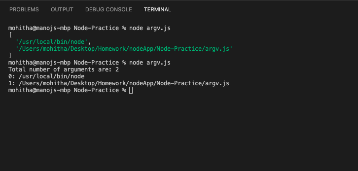

# Node-Practice
practicing node js commands 

# process.argv() Method in Node.js
The process.argv() method is used for returning all the command-line arguments that were passed when the Node.js process was being launched.

# Results

